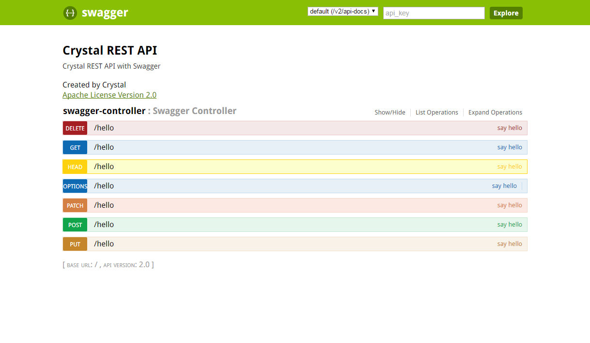

# 目的#
 
实验SpringBoot集成swagger
	
# 步骤 #

**STEP1.Gradle中引用依赖的jar**
	
	compile('io.springfox:springfox-swagger2:2.2.2')
	compile('io.springfox:springfox-swagger-ui:2.2.2')

**STEP2.修改在XXXApplication.java**
	
	1.在class上添加@EnableSwagger2

	2.增加swagger相关的region
	// #region swagger

	@Bean
	public Docket createRestApi() {
		return new Docket(DocumentationType.SWAGGER_2).apiInfo(apiInfo()).select()
				.apis(RequestHandlerSelectors.
				//注意此处包名要填写正确，否则不能正确扫描出所需接口
				basePackage("com.huawei")).paths(PathSelectors.any()).build();
	}

	private ApiInfo apiInfo() {
		return new ApiInfoBuilder().title("Crystal REST API").description("Crystal REST API with Swagger")
				.termsOfServiceUrl("http://www.google.com").contact("Crystal").license("Apache License Version 2.0")
				.licenseUrl("https://github.com/IBM-Bluemix/news-aggregator/blob/master/LICENSE").version("2.0")
				.build();
	}

	// #endregion

**STEP3.修改XXXcontroller.java**
	
	@RestController
	public class SwaggerController {
		// #region Fields
	
		@Autowired
		private SwaggerService swaggerService;
	
		// #endregion
	
		// #region hello
		在restful接口处添加@ApiOperation和@ApiImplicitParam注解
		@ApiOperation(value = "say hello", notes = "notes....")
		@ApiImplicitParam(name = "oReqVo", value = "ReqVo数据结构", required = true, dataType = "ReqVo")
		//@RequestMapping中如果不指定具体http请求的类型，则会生成全部类型的接口说明
		@RequestMapping("/hello")
		@ResponseBody
		public String hello(@RequestBody ReqVo oReqVo) {
			return this.swaggerService.hello(oReqVo);
		}

		// #endregion
}

	
**STEP4.访问http://localhost:7000/swagger-ui.html即可看到对相应接口的说明；同时可以构造相应数据发送http请求进行测试**

# reference #
	
	http://heidloff.net/article/usage-of-swagger-2-0-in-spring-boot-applications-to-document-apis/
	http://swagger.io/docs/
	
	TODO:ReqVo过大或过于复杂时是否能实现相应接口的测试